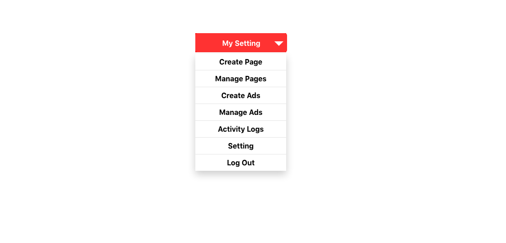

# reasonml-dropdown-menu-tutorial

Today, In this tutorial we are are going to discuss how to create simple drop down menu in Reason-React and we have tried our best to make this tutorial as simple as possible. Here we are going to design CSS Dropdown menu with the help of ReasonML and also with the help of onClick Event, we are showing and hiding the drop down menu content.



Lets see the below source code, which help you to build more understanding:

## Dropdown.re

This is a Dropdown component module, which help us to render the dropdown menu content. When a user clicks on the dropdown menu, then this module renders the updated dropdown menu list in browser.


We use define the app state we want to control with `type state`. Then we define the action we want to control with `type action`.

```reason
type state = {showList: bool};

type action =
  | ShowList
  | ItemClick;

```

We use `React.useReducer` to control showing and hiding the list by passing the function our `state` and `actions` which we defined above. The last line of our reducer, `{showList: false}` defines our initial state. So here we are defining `showList` as `false`. The second argument to the reducer takes the actions we want to use. Here we call it `dispatch` since that seems to be the convention and because its discriptive of what we are doing. We are dispatching the action. The signature for `let (state, dispatch)` is called a `tuple`. It's and array of two arguments which the ReasonML/Ocaml compiler recognizes by the arguments positions as they are passed in. So it expects and `action` as the second argument what ever you decide to call it.

```reason
let (state, dispatch) =
    React.useReducer(
      (state, action) =>
        switch (action) {
        | ShowList => {showList: !state.showList}
        | ItemClick => state
        },
      {showList: false},
    );
```

I hope this helps. Feel free to reach out with any questions. The source code can be found [here](https://github.com/idkjs/reasonml-dropdown-menu-tutorial).

